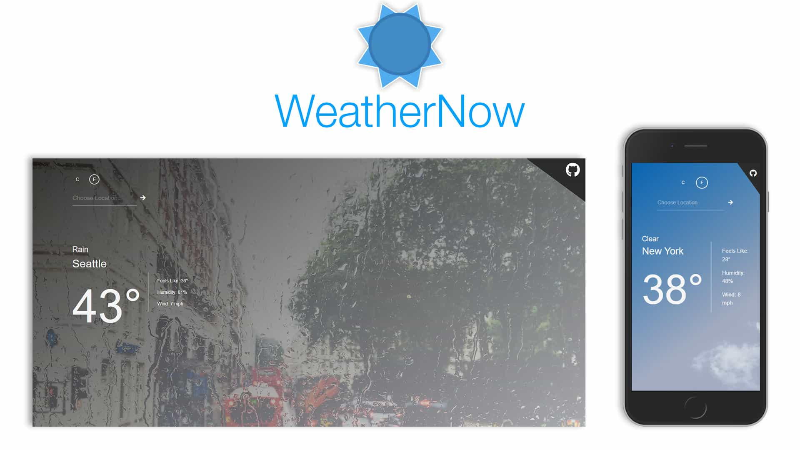

# WeatherNow
Get real time weather data at your current location (or anywhere for that matter)!

### Live Link
https://andrewleach94.github.io/weather-app/

### New in V2:
- Added location services to automatically locate the user's closest city
- Added a lottie animation built in Adobe Illustrator and After Effects to play while weather data is being fetched.
- Measurement units now default to Metric but will automatically set to Fahrenheit if the user has their browser set to American English.

#### Overview
My first API project. See real time weather data at your location or the city of your choosing. It includes customizable units and dynamic backgrounds that change based on the current conditions. This app is made possible by the OpenWeather API. 
